# VIANEO Framework - Master Repository

> **Evidence-based startup evaluation framework** | 5 Dimensions | 13-Step Process | Committee-Ready Outputs

[]() []() []()

## 🎯 Repository Status

**✅ PRODUCTION READY** - All 13 evaluation prompts are complete with comprehensive reference materials, scoring frameworks, and quality checklists. This repository contains everything needed to conduct rigorous, evidence-based startup evaluations.

**Recent Updates (November 2025):**
- ✅ All prompt files updated with complete, executable content
- ✅ 8,765 lines of comprehensive methodology added
- ✅ Full question frameworks embedded (40Q, 29Q, and all deep-dive prompts)
- ✅ Evidence requirements and validation checklists included
- ✅ Professional output specifications and templates integrated
- ✅ AI assistant execution instructions added to all steps

## Table of Contents

- [Quick Start](#quick-start)
- [What is VIANEO?](#what-is-vianeo)
- [Framework at a Glance](#framework-at-a-glance)
- [Repository Structure](#repository-structure)
- [The 5 VIANEO Dimensions](#the-5-vianeo-dimensions)
- [Usage Workflows](#usage-workflows)
- [Integration with Claude](#integration-with-claude)
- [Common Questions](#common-questions)
- [Contributing](#contributing)

---

## Quick Start

**First-time users** - Get started in 5 minutes:

1. **Read** [Framework Overview](docs/FRAMEWORK_OVERVIEW.md) - Understand the 13 steps
2. **Start** with [Step 0: Executive Brief](prompts/step_00_executive_brief_extraction.md) - Transform raw materials into structured brief
3. **Assess** with [Step 2: 40Q Diagnostic](prompts/step_02_diagnostic_40q.md) - Rapid comprehensive assessment
4. **Validate** with [Step 3: Market Maturity](prompts/step_03_market_maturity_29q.md) - Score across 5 dimensions

**Experienced users** - Quick reference:
- **Prompts**: `prompts/` - All 13 evaluation prompts (Step 0-12)
- **Templates**: `templates/` - Professional output templates
- **Docs**: `docs/` - Methodology guides and checklists
- **Examples**: `examples/` - Sample assessments

---

## What is VIANEO?

The **VIANEO Business Model Evaluation Framework** is a comprehensive, evidence-based methodology for assessing startup and innovation project viability.

### Core Features

- **5 Critical Dimensions** - Legitimacy, Desirability, Acceptability, Feasibility, Viability
- **13-Step Sequential Process** - From initial screening to viability dashboards
- **Evidence-Based Scoring** - Clear thresholds and validation requirements
- **Professional Outputs** - Markdown, DOCX, HTML, PDF formats
- **Reusable Templates** - Consistent evaluation across projects

### Framework Philosophy

> "Every sentence must add unique value. Conciseness over comprehensiveness, specificity over abstraction, actionability over analysis, evidence-based over aspirational."

## Framework at a Glance

**The 13-Step Evaluation Process:**

| Phase | Step | Name | Time | Key Output |
|-------|------|------|------|------------|
| **Phase 1: Foundation** | 0 | Executive Brief | 20-30m | Structured 7-section brief |
| | 1 | Application Forms | 15-20m | Program-specific docs |
| | 2 | 40Q Diagnostic | 30-45m | 4-dimension assessment |
| | 3 | 29Q Market Maturity | 45-60m | 5-dimension VIANEO scores |
| **Phase 2: Deep Dive** | 4 | Legitimacy Worksheet | 30-40m | Foundation validation |
| | 5 | Needs/Requesters | 45-60m | WHO/WHAT/WHY/HOW analysis |
| | 6 | Personas | 30-45m | Evidence-based personas |
| | 7 | Needs Qualification | 45-90m | Interactive matrix + report |
| | 8 | Players/Influencers | 30-40m | Ecosystem acceptability |
| | 9 | Value Network Map | 45-60m | Network visualization |
| **Phase 3: Synthesis** | 10 | Diagnostic Comment | 25-35m | Executive decision brief |
| | 11 | Features-Needs Matrix | 30-45m | MVP scope analysis |
| **Phase 4: Viability** | 12 | Viability Assessment | 2-4h | PMF sheets, Business models, Dashboard |

**Core Steps**: Steps 0, 2, and 3 are required. Others are optional based on project needs.

**Detailed descriptions**: See [Framework Overview](docs/FRAMEWORK_OVERVIEW.md) for complete step details.

## Repository Structure

```
vianeo-framework/
├── prompts/              # Step 0-12 sequential evaluation prompts
├── docs/                 # Comprehensive documentation & guides
│   ├── FORMAT_SPEC_*.md       # Output format specifications
│   ├── QUICK_VALIDATION_*.md  # Quality checklists
│   └── VIANEO_*_Guide.md      # Reference guides
├── templates/            # Output templates (Markdown, DOCX, HTML)
├── examples/             # Sample assessments by maturity stage
├── tools/                # Automation scripts
└── README.md             # This file
```

**Key Directories:**
- **`prompts/`** - 13 complete evaluation prompts (step_00 through step_12) with **9,300+ lines** of executable content
  - All 40 questions for Step 2 Diagnostic (Team, Technology, Management, Commercial)
  - All 29 questions for Step 3 Market Maturity (5 VIANEO dimensions)
  - Complete frameworks for Steps 4-12 (Legitimacy, Desirability, Acceptability, Feasibility, Viability)
  - Embedded scoring scales, evidence requirements, and quality checklists
- **`docs/`** - 48+ reference documents, format specs, quality checklists
- **`templates/`** - Professional output templates for all deliverables
- **`examples/`** - Real assessment examples (Early Stage, Promising, Growth)

### Prompt Completeness

| Step | Prompt File | Status | Content Size | Key Features |
|------|-------------|--------|--------------|--------------|
| 0 | Executive Brief | ✅ Complete | 23KB | 7-section brief, character limits, maturity stages |
| 2 | 40Q Diagnostic | ✅ Complete | 43KB | All 40 questions, scoring rubrics, red flags |
| 3 | 29Q Market Maturity | ✅ Complete | 22KB | 5 dimensions, weighted scoring, thresholds |
| 4 | Legitimacy Worksheet | ✅ Complete | 26KB | Problem validation framework |
| 5 | Needs/Requesters | ✅ Complete | 43KB | WHO/WHAT/WHY/HOW, 4-file output |
| 6 | Persona Development | ✅ Complete | 15KB | Evidence-based personas, validation badges |
| 7 | Needs Qualification | ✅ Complete | 26KB | Interactive matrix, priority zones |
| 8 | Players/Influencers | ✅ Complete | 42KB | Ecosystem mapping, stakeholder analysis |
| 9 | Value Network | ✅ Complete | 30KB | Network visualization, value flows |
| 10 | Diagnostic Comment | ✅ Complete | 18KB | Executive decision brief |
| 11 | Features-Needs Matrix | ✅ Complete | 12KB | MVP scope, feature prioritization |
| 12 | Viability Assessment | ✅ Complete | 7KB | PMF sheets, business models, dashboard |

**Total:** 9,314 lines of comprehensive, executable evaluation content

## The 5 VIANEO Dimensions

| Dimension | Weight | Threshold | Key Question |
|-----------|--------|-----------|--------------|
| **Legitimacy** | 15% | ≥3.0 | Is there a real problem worth solving? |
| **Desirability** ⭐ | 25% | **≥3.5** | Do specific people want YOUR solution? |
| **Acceptability** | 20% | ≥3.0 | Will the ecosystem support you? |
| **Feasibility** | 20% | ≥3.0 | Can you actually deliver? |
| **Viability** | 20% | ≥3.0 | Is the business model sustainable? |

**Overall Threshold**: ≥3.2 weighted average | **Highest Bar**: Desirability ≥3.5

### Scoring Principles

- **Evidence-based** - Every claim requires documentation
- **Conservative** - Use "Don't Know" when uncertain
- **Specific** - Numbers, names, concrete examples required
- **Actionable** - Clear next steps for every gap identified

## Usage Workflows

### Individual Project Evaluation

```mermaid
graph LR
    A[Step 0: Executive Brief] --> B[Step 2: 40Q Diagnostic]
    B --> C[Step 3: Market Maturity]
    C --> D{Scores ≥ Thresholds?}
    D -->|Yes| E[Steps 4-9: Deep Dives]
    D -->|No| F[Stop or Pivot]
    E --> G[Step 10: Diagnostic]
    E --> H[Step 11: Features-Needs]
    G --> I[Step 12: Viability Assessment]
    H --> I
```



**Standard Path**:
1. **Step 0** (Executive Brief) - Always required, transforms raw materials
2. **Step 2** (40Q Diagnostic) - Rapid 4-dimension assessment
3. **Step 3** (29Q Market Maturity) - Comprehensive VIANEO scoring
4. **If passing**: Proceed to relevant deep dives (Steps 4-9)
5. **Step 10** (Diagnostic Comment) - Executive decision brief
6. **Step 11** (Features-Needs) - MVP scope definition
7. **Step 12** (Viability Assessment) - PMF sheets, business models, viability dashboard

### Program/Portfolio Management

- **Cadence**: Quarterly evaluations, per-cohort assessments
- **Standardization**: Use Step 1 for consistent application formats
- **Tracking**: Monitor dimension scores over time
- **Reviews**: Use Step 10 diagnostics for portfolio decisions
- **Archive**: Maintain historical comparison data

## Integration with Claude

### Connected Repository Setup

Connect this repository to Claude to enable:
- Direct access to all prompts, templates, and documentation
- Consistent methodology across evaluations
- Version-controlled framework updates
- Seamless reference to quality standards

### Claude Projects Best Practices

For company-specific evaluations:
- Create **separate Claude Projects** per company
- Upload company materials to isolated projects
- Reference this master repository for methodology
- Maintain confidentiality and data separation

**Tip**: Use `docs/` reference guides in Claude project knowledge for consistent outputs.

---

## Common Questions

**Q: Do I need to run all 13 steps?**
No. Steps 0, 2, and 3 are core. Others (4-12) are optional based on project needs and decision requirements.

**Q: What's the minimum for a "GO" decision?**
Overall score ≥3.2 (weighted average) with all dimensions meeting thresholds. **Critical**: Desirability must score ≥3.5.

**Q: How many customer interviews are required?**
- Basic validation: 5+ interviews per segment
- Strong validation: 10+ interviews per segment
- Validated persona: Evidence from 5+ interviews

**Q: Can I modify the framework?**
Yes, but maintain core principles: evidence-based evaluation, conservative scoring, specific examples, actionable insights.

**Q: What outputs are generated?**
Professional deliverables in multiple formats: Markdown (reports), DOCX (presentations), HTML (interactive matrices), suitable for committees, boards, and investors.

**Q: Are all prompts ready to use?**
Yes. All 13 prompts are production-ready with complete content:
- All question frameworks embedded (40Q Diagnostic, 29Q Market Maturity)
- Scoring scales and evidence requirements included
- Quality checklists and validation steps integrated
- Output format specifications provided
- AI assistant instructions for automated execution

**Q: How do I use this with AI assistants?**
Each prompt file includes:
- Clear execution instructions for AI assistants
- Structured input/output specifications
- Evidence requirements and validation standards
- Common pitfalls to avoid
- Quality control measures

Simply provide the prompt file and your project materials to any capable AI assistant (Claude, GPT-4, etc.)

---

## Contributing

This is a master reference repository. Contributions welcome via:

1. **Pull Requests** - Propose methodology improvements
2. **Documentation** - Add examples, clarify guides
3. **Templates** - Enhance output quality
4. **Issues** - Report bugs, suggest features

**Requirements**: Document rationale, ensure backward compatibility, update examples.

---

## Version & License

**Version**: 2.0 - Production-ready with complete prompts, comprehensive reference materials, and full methodology
- All 13 steps with complete, executable content (9,300+ lines)
- 48+ reference documents, format specifications, and quality checklists
- Professional templates for all deliverables
- Example assessments across maturity stages

**Previous Version**: 1.0 - Framework structure with placeholder content
**License**: [To be determined]
**Contact**: [Contact information to be added]

### What's Included

**Comprehensive Prompts (prompts/):**
- Complete question frameworks with scoring scales (1-5 with evidence requirements)
- Embedded validation checklists and quality controls
- Output format specifications and professional templates
- AI assistant execution instructions
- Integration guidance between steps

**Reference Documentation (docs/):**
- Format specifications for each step's outputs
- Quick validation checklists (QUICK_VALIDATION_*.md)
- Quick reference guides (question definitions, scoring methodology)
- System overview and workflow guides
- Evidence checklists and diagnostic templates

**Professional Templates (templates/):**
- Markdown templates for all reports
- DOCX format specifications
- HTML interactive tools (matrices, heatmaps)
- Evidence logs and hypotheses tracking

**Example Assessments (examples/):**
- Early-stage startup evaluation
- Promising venture assessment
- Growth-stage analysis

---

## Additional Resources

- **[Framework Overview](docs/FRAMEWORK_OVERVIEW.md)** - Detailed step descriptions
- **[Quick Reference Card](docs/VIANEO_Quick_Reference_Card.md)** - One-page cheat sheet
- **[Assessment Workflow Guide](docs/VIANEO_Assessment_Workflow_Guide.md)** - Complete process guide
- **[Evidence Checklist](docs/VIANEO_Evidence_Checklist.md)** - Validation requirements
- **[Example Assessments](examples/)** - Sample evaluations by stage

---

**Framework Philosophy**: *"Every sentence must add unique value. Conciseness over comprehensiveness, specificity over abstraction, actionability over analysis, evidence-based over aspirational."*
